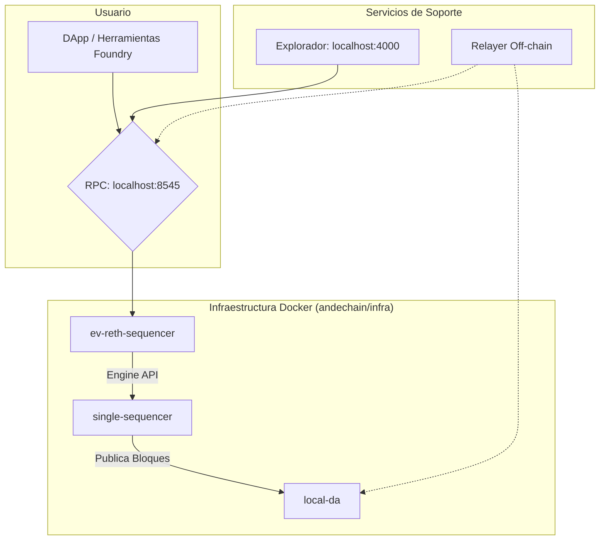

<div align="center">

# 🏔️ AndeChain - Un Rollup Soberano para LATAM

[](https://opensource.org/licenses/MIT)
[](https://github.com/munay-dev/ande-labs/actions/workflows/ci-cd.yml)
[](https://github.com/munay-dev/ande-labs/actions/workflows/infra-ci-cd.yml)

</div>

## 🌟 Visión

AndeChain es una blockchain soberana regional que inicia en Bolivia y se expande, construida como un **Rollup EVM sobre Celestia**. Nuestra misión es resolver la fragmentación financiera de América Latina a través de un sistema económico robusto y una infraestructura tecnológica de vanguardia.

Para una inmersión profunda en la visión y el modelo económico, consulta el [plan del proyecto](../planande.md) y los [tokenomics](../tokenomics.md).

## 🏗️ Arquitectura Técnica

Nuestro stack tecnológico está completamente contenedorizado con Docker y se gestiona desde el directorio `infra/`.



## 🚀 Guía de Inicio Rápido (Desarrollo Local)

**Requisitos:**
- Docker Desktop
- Foundry (Kit de herramientas para Solidity)

**Pasos:**

1.  **Resetear y Levantar el Stack:**
    Este es el comando principal para iniciar un entorno limpio. Se ejecuta desde `andechain/infra`.
    ```bash
    cd andechain/infra
    docker compose down -v && docker compose up -d --build
    ```
    *Tu rollup soberano local estará funcionando en `http://localhost:8545`.*

2.  **Desplegar los Contratos de Prueba:**
    En otra terminal, despliega los contratos del bridge para poder interactuar con ellos.
    ```bash
    cd andechain/contracts
    export PRIVATE_KEY=0xac0974bec39a17e36ba4a6b4d238ff944bacb478cbed5efcae784d7bf4f2ff80
    forge script script/DeployBridge.s.sol --tc DeployBridge --rpc-url local --broadcast
    ```

Para una guía mucho más detallada sobre el flujo de desarrollo, troubleshooting y la arquitectura, consulta el **[Manual de Operaciones (ONBOARDING.md)](./ONBOARDING.md)**.

## 📜 Contratos Desplegados (Entorno Local)

Estas son las direcciones de los contratos después de ejecutar el script `DeployBridge.s.sol` en un entorno local reseteado.

| Contrato | Dirección en la Red Local (`chainId: 1234`) |
| :-------------------- | :------------------------------------------ |
| `MockABOB` | `0x5FbDB2315678afecb367f032d93F642f64180aa3` |
| `MockUSDC` | `0xe7f1725E7734CE288F8367e1Bb143E90bb3F0512` |
| `MockBlobstream` | `0x9fE46736679d2D9a65F0992F2272dE9f3c7fa6e0` |
| `AndeBridge` | `0xCf7Ed3AccA5a467e9e704C703E8D87F634fB0Fc9` |
| `EthereumBridge` | `0xDc64a140Aa3E981100a9becA4E685f962f0cF6C9` |

## 📚 Estructura y Documentación del Proyecto

-   **[ONBOARDING.md](./ONBOARDING.md)**: **(LEER PRIMERO)** El manual principal para desarrolladores y operadores. Contiene guías detalladas, solución de problemas y lecciones aprendidas.
-   **[contracts/README.md](./contracts/README.md)**: Documentación específica del stack de Smart Contracts (Foundry).
-   **[infra/README.md](./infra/README.md)**: Documentación específica del stack de infraestructura (Docker, Rollup).
-   **[relayer/README.md](./relayer/README.md)**: Documentación específica del servicio de relayer off-chain.
-   **[GIT_WORKFLOW.md](./GIT_WORKFLOW.md)**: Nuestras convenciones y estrategia de ramas para contribuir al proyecto.
