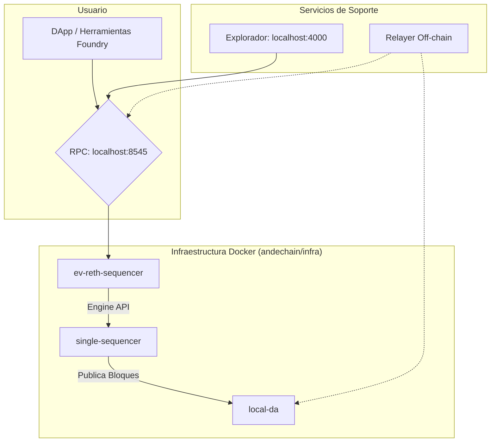

<div align="center">

# 🏔️ AndeChain - Un Rollup Soberano para LATAM

[](https://opensource.org/licenses/MIT)
[](https://github.com/munay-dev/ande-labs/actions/workflows/ci-cd.yml)
[](https://github.com/munay-dev/ande-labs/actions/workflows/infra-ci-cd.yml)

</div>

## 🌟 Visión

AndeChain es una blockchain soberana regional que inicia en Bolivia y se expande, construida como un **Rollup EVM sobre Celestia**. Nuestra misión es resolver la fragmentación financiera de América Latina a través de un sistema económico robusto y una infraestructura tecnológica de vanguardia.

**Token Nativo**: ANDE es la moneda nativa de la chain, utilizada para pagos de gas y gobernanza. Esto garantiza verdadera soberanía económica sin dependencias externas.

Para una inmersión profunda en la visión y el modelo económico, consulta el [plan del proyecto](../planande.md) y los [tokenomics](../tokenomics.md).

## 🏗️ Arquitectura Técnica

Nuestro stack tecnológico está completamente contenedorizado con Docker y se gestiona desde el directorio `infra/`.



## 🚀 Guía de Inicio Rápido (Desarrollo Local)

Esta guía te permitirá levantar todo el ecosistema de AndeChain en tu máquina local.

**Requisitos Previos:**
- Docker Desktop
- Foundry (Kit de herramientas para Solidity)
- Node.js y npm

### Pasos para el Despliegue Local

**1. Iniciar la Infraestructura Blockchain**

Este comando levanta todos los servicios de backend (Nodo, Sequencer, Explorador, etc.) en segundo plano.

```bash
# Desde la raíz de andechain/
cd infra
docker compose up -d --force-recreate
cd ..
```

**2. Desplegar y Verificar los Contratos**

Estos comandos, definidos en el `Makefile`, compilan, despliegan y verifican todo el ecosistema de contratos inteligentes en la red local.

```bash
# Desde la raíz de andechain/
make deploy-ecosystem
make verify-contracts
```
*Después de ejecutar `make deploy-ecosystem`, la terminal mostrará un resumen completo con todas las direcciones de los contratos recién desplegados.*

**3. Iniciar el Frontend**

Este comando inicia la aplicación web para interactuar con el ecosistema.

```bash
# Desde la raíz del repositorio (ande-labs/)
cd ande-frontend
npm run dev
```

### Puntos de Acceso al Ecosistema

-   **Frontend dApp:** [http://localhost:9002](http://localhost:9002)
-   **Explorador de Bloques (Blockscout):** [http://localhost:4000](http://localhost:4000)
-   **RPC Endpoint:** `http://localhost:8545`

Para una guía mucho más detallada sobre el flujo de desarrollo, troubleshooting y la arquitectura, consulta el **[Manual de Operaciones (ONBOARDING.md)](./ONBOARDING.md)**.

## 📚 Estructura y Documentación del Proyecto

-   **[ONBOARDING.md](./ONBOARDING.md)**: **(LEER PRIMERO)** El manual principal para desarrolladores y operadores. Contiene guías detalladas, solución de problemas y lecciones aprendidas.
-   **[NATIVE_ANDE_MIGRATION.md](./NATIVE_ANDE_MIGRATION.md)**: **Guía de migración a ANDE como token nativo de gas**. Proceso completo para hacer AndeChain verdaderamente soberana.
-   **[HEALTH_CHECK.md](./HEALTH_CHECK.md)**: Guía con comandos para realizar una auditoría y verificación completa del proyecto.
-   **[FIXES_APPLIED.md](./FIXES_APPLIED.md)**: Reporte de correcciones aplicadas a fallos críticos identificados.
-   **[TEST_COVERAGE_IMPROVEMENT.md](./TEST_COVERAGE_IMPROVEMENT.md)**: Reporte de mejoras en cobertura de tests (MintController: 31% → 72%).
-   **[contracts/README.md](./contracts/README.md)**: Documentación específica del stack de Smart Contracts (Foundry).
-   **[infra/README.md](./infra/README.md)**: Documentación específica del stack de infraestructura (Docker, Rollup).
-   **[relayer/README.md](./relayer/README.md)**: Documentación específica del servicio de relayer off-chain.
-   **[GIT_WORKFLOW.md](./GIT_WORKFLOW.md)**: Nuestras convenciones y estrategia de ramas para contribuir al proyecto.
