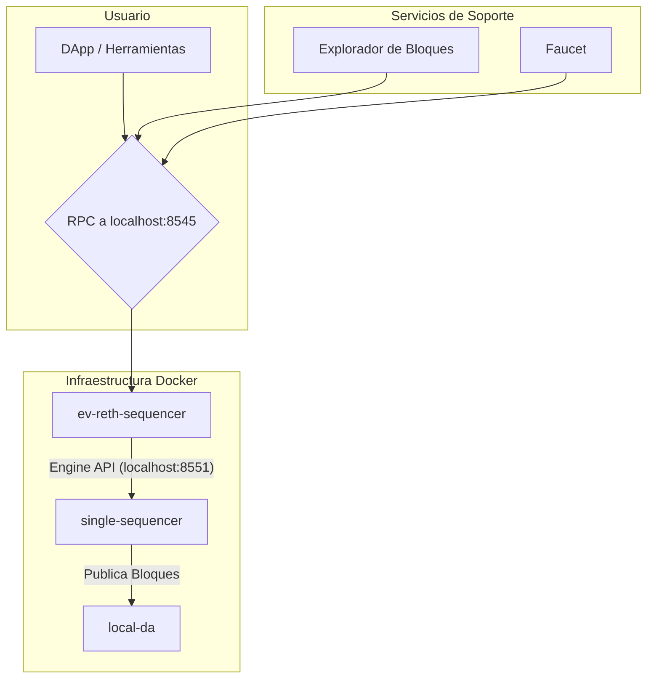

<div align="center">

# 🏔️ AndeChain - Un Rollup Soberano para LATAM

[](https://opensource.org/licenses/MIT)
[](https://github.com/[GITHUB_USER]/[GITHUB_REPO]/actions/workflows/ci-cd.yml)
[](https://github.com/[GITHUB_USER]/[GITHUB_REPO]/actions/workflows/infra-ci-cd.yml)

</div>


## 🌟 Visión

AndeChain es una blockchain soberana regional que inicia en Bolivia y se expande, construida como un **Rollup EVM sobre Celestia**. Nuestra misión es resolver la fragmentación financiera de América Latina a través de un sistema económico robusto y una infraestructura tecnológica de vanguardia.

Para una inmersión profunda en la visión y el modelo económico, consulta el documento de visión del proyecto.

## 🏗️ Arquitectura Técnica

Nuestro stack tecnológico está completamente contenedorizado con Docker y se gestiona desde el directorio `/infra`.



**Descripción de Componentes:**

1.  **`ev-reth-sequencer` (Motor de Ejecución):**
    *   **Tecnología:** `Reth`.
    *   **Función:** Ejecuta la lógica de los Smart Contracts y expone el RPC principal en el puerto `8545`.

2.  **`single-sequencer` (Director de Orquesta):**
    *   **Tecnología:** `Evolve / ev-node`.
    *   **Función:** Se comunica con el motor de ejecución para ordenar transacciones, crear bloques y publicarlos en la capa de DA.

3.  **`local-da` (Notario Público):**
    *   **Tecnología:** Simulador de Celestia.
    *   **Función:** Almacena los datos de los bloques, garantizando su disponibilidad.

El stack también incluye un **Explorador de Bloques** (`http://localhost:4000`) y un **Faucet** (`http://localhost:8081`) para un ciclo de desarrollo completo.

## 🚀 Guía de Inicio Rápido (Desarrollo Local)

**Requisitos:**
- Docker Desktop
- Foundry (Kit de herramientas para desarrollo en Solidity)

**Pasos:**

1.  **Navega al directorio de infraestructura:**
    ```bash
    cd andechain/infra
    ```

2.  **Configura el entorno:**
    Copia el archivo de ejemplo para crear tu configuración local. Para el desarrollo inicial, los valores por defecto son suficientes.
    ```bash
    cp .env.example .env
    ```

3.  **Lanza el Stack:**
    Este comando levantará todos los servicios en segundo plano.
    ```bash
    docker compose up -d --build
    ```
    ¡Y listo! Tu rollup soberano local estará funcionando en `http://localhost:8545`.

## 🛠️ Flujo de Desarrollo de Contratos (Foundry)

Todo el desarrollo de smart contracts se realiza en el directorio `andechain/contracts` usando **Foundry**.

1.  **Navega al directorio de contratos:**
    ```bash
    cd andechain/contracts
    ```

2.  **Instala Dependencias:**
    ```bash
    forge install
    ```

3.  **Compila los Contratos:**
    ```bash
    forge build
    ```

4.  **Ejecuta las Pruebas:**
    ```bash
    forge test
    ```

5.  **Despliega un Script:**
    ```bash
    forge script script/Counter.s.sol --rpc-url http://localhost:8545 --broadcast
    ```

## 📜 Contratos Desplegados

| Contrato | Red Local (localhost) | Testnet | Mainnet |
| :---------------- | :-------------------- | :------ | :------ |
| `P2POracleV2` | `0x...` | `0x...` | `0x...` |
| `ANDEToken` | `0x...` | `0x...` | `0x...` |
| *y otros...* | `...` | `...` | `...` |

## 📚 Documentación Adicional

Para una inmersión más profunda, consulta las siguientes guías dentro de este directorio (`andechain`):

-   **[GUIA_DESPLIEGUE_LOCAL.md](./GUIA_DESPLIEGUE_LOCAL.md)**: Guía detallada del entorno local.
-   **[ONBOARDING.md](./ONBOARDING.md)**: Manual de incorporación para nuevos ingenieros, con lecciones aprendidas y patrones de diseño.
-   **[GIT_WORKFLOW.md](./GIT_WORKFLOW.md)**: Nuestras convenciones y estrategia de ramas para contribuir al proyecto.