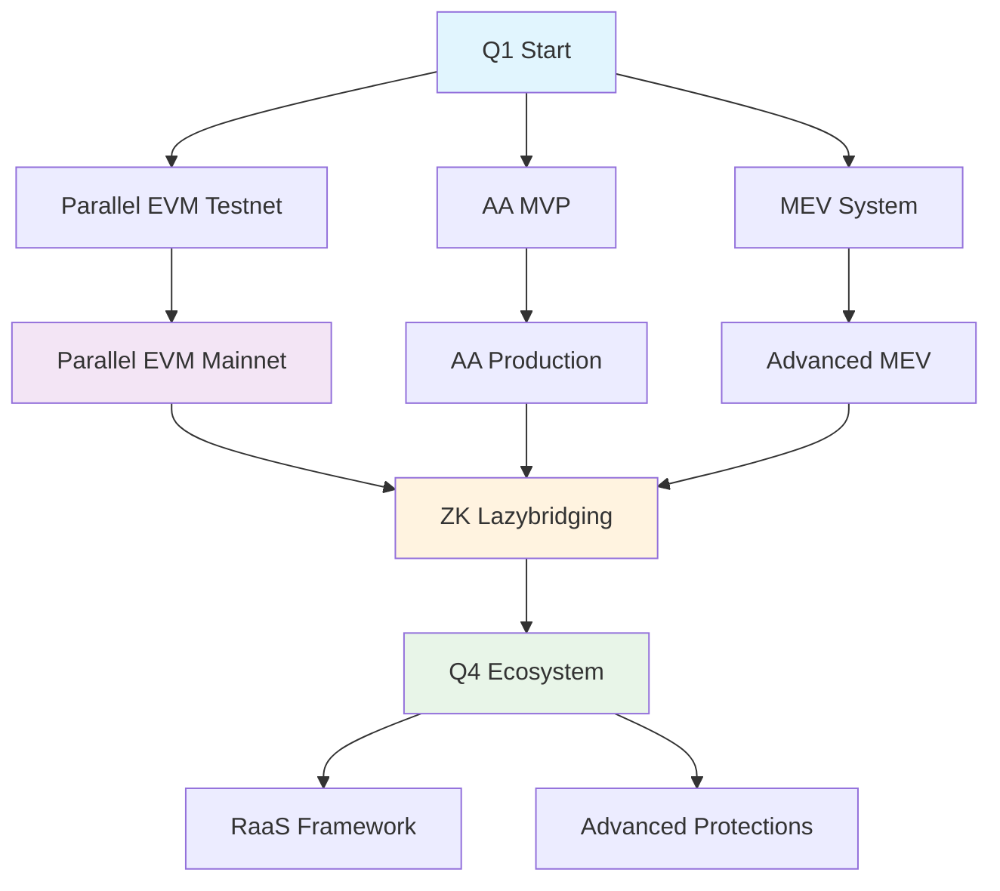

# 🚀 Plan de Implementación - AndeChain Rollup Innovations 2025

## 📋 Executive Summary

Este plan establece la implementación de tecnologías de vanguardia para AndeChain, posicionándolo como uno de los rollups más avanzados técnicamente en 2025. La estrategia se centra en 3 pilares fundamentales que aprovechan la arquitectura existente de Celestia DA y dual-token.

## 🎯 **Objetivos Estratégicos**

### Primary Goals (2025)
1. **10x Speed Improvement** - Implementar Parallel EVM para throughput masivo
2. **Web2 User Experience** - Account Abstraction con pagos en $ANDE
3. **Instant Cross-Chain** - ZK-powered lazybridging <5 segundos
4. **Economic Sustainability** - MEV redistribution y tokenomics avanzadas

### Competitive Advantage
- **Único**: Combinación de Parallel EVM + Celestia DA + Dual-Token + AA + ZK Bridge
- **Diferenciador**: Experiencia Web2 con soberanía económica nativa
- **Posicionamiento**: Competir directamente con zkSync, Scroll, Polygon zkEVM

---

## 📊 **Current State Analysis**

### ✅ **Fortalezas Existentes**
- **Celestia DA Integration** - Data availability resuelto
- **Dual-Token Architecture** - $ANDE como gas nativo + governance
- **Smart Contract Ecosystem** - Tokenomics V3.0 implementadas
- **Docker Infrastructure** - Stack modular rollup funcional
- **Security Framework** - Auditorías y tests implementados

### 🎯 **Bottlenecks a Resolver**
- **Ejecución Secuencial** - Limitación actual de throughput
- **Bridge Latency** - Bridges actuales toman minutos
- **UX Compleja** - Requiere EOAs y gestión de gas manual
- **MEV No Capturada** - Oportunidad económica desaprovechada

---

## 🗓️ **Implementation Roadmap**

## **Q1 2025: Foundation & Quick Wins (Enero - Marzo)**

### **🚀 Parallel EVM Testnet (Semanas 1-12)**
**Timeline**: 3 meses | **Priority**: CRITICAL | **Team**: 2-3 engineers

#### Phase 1: Research & Setup (Semanas 1-4)
- [ ] **Week 1-2**: Clone y estudio de RISE pevm
  ```bash
  git clone https://github.com/risechain/pevm
  cargo build && cargo test --workspace --release
  ```
- [ ] **Week 3**: Análisis de benchmarks y MVDS architecture
- [ ] **Week 4**: Diseño de integración con ev-node actual

#### Phase 2: Integration Development (Semanas 5-8)
- [ ] **Week 5-6**: Adaptar pevm para stack AndeChain
- [ ] **Week 7**: Implementar lazy beneficiary updates
- [ ] **Week 8**: Testing básico con bloques de prueba

#### Phase 3: Testing & Optimization (Semanas 9-12)
- [ ] **Week 9-10**: Replay de mainnet blocks para comparación
- [ ] **Week 11**: Optimización EVM-específica
- [ ] **Week 12**: Deploy en testnet y métricas iniciales

**Métricas de Éxito**:
- [ ] Speedup 5x en bloques típicos
- [ ] <10% re-ejecución rate
- [ ] 100% EVM compatibility

---

### **🔐 Account Abstraction MVP (Semanas 1-10)**
**Timeline**: 2.5 meses | **Priority**: HIGH | **Team**: 2 engineers

#### Phase 1: Core Contracts (Semanas 1-4)
- [ ] **Week 1**: EntryPoint contract implementation
- [ ] **Week 2**: ANDEPaymaster para pagos en $ANDE
- [ ] **Week 3**: ANDEAccount smart contract wallet
- [ ] **Week 4**: Testing unitario completo

#### Phase 2: Infrastructure (Semanas 5-7)
- [ ] **Week 5**: Bundler setup (Infinitism o Stackup)
- [ ] **Week 6**: Configuración de red para AndeChain
- [ ] **Week 7**: Integration tests con contratos desplegados

#### Phase 3: Frontend Integration (Semanas 8-10)
- [ ] **Week 8-9**: Wallet integration con userop.js
- [ ] **Week 10**: Testing end-to-end + documentación

**Métricas de Éxito**:
- [ ] 100% transacciones ejecutables con $ANDE
- [ ] <2s latencia UserOp submission
- [ ] Bundler procesa >100 UserOps/segundo

---

### **💰 MEV Redistribution System (Semanas 8-12)**
**Timeline**: 1.5 meses | **Priority**: MEDIUM | **Team**: 1 engineer

- [ ] **Week 8-9**: MEV capture a nivel de sequencer
- [ ] **Week 10**: Sistema de redistribución a veANDE stakers
- [ ] **Week 11-12**: Subastas de orden estilo Flashbots

---

## **Q2 2025: Infrastructure & Integration (Abril - Junio)**

### **⚡ ZK-Powered Lazybridging (Semanas 13-24)**
**Timeline**: 3 meses | **Priority**: HIGH | **Team**: 2-3 engineers

#### Phase 1: ZK Infrastructure (Semanas 13-16)
- [ ] **Week 13**: Setup de Circom y SnarkJS
- [ ] **Week 14**: Diseño de circuitos ZK para bridge state
- [ ] **Week 15-16**: Trusted setup ceremony y generación de keys

#### Phase 2: Celestia Integration (Semanas 17-20)
- [ ] **Week 17-18**: Cliente IBC light client para Celestia
- [ ] **Week 19**: Integration con ZK verifier
- [ ] **Week 20**: Testing de proof submission a Celestia

#### Phase 3: Bridge Flow Implementation (Semanas 21-24)
- [ ] **Week 21-22**: LazybridgeRelay contract implementation
- [ ] **Week 23**: Flow end-to-end testing
- [ ] **Week 24**: Beta en testnet

**Métricas de Éxito**:
- [ ] Bridge time <5 segundos (99th percentile)
- [ ] Proof generation <1 segundo
- [ ] Costo <50% del bridge actual

---

### **🔧 Advanced Precompiles (Semanas 18-22)**
**Timeline**: 1.5 meses | **Priority**: MEDIUM | **Team**: 1 engineer

- [ ] Precompile para ZK proof verification (dirección 0xFE)
- [ ] Precompile para staking optimizado (dirección 0xFF)
- [ ] Precompile para cross-chain messaging nativo

---

### **📊 Observability Layer (Semanas 20-26)**
**Timeline**: 2 meses | **Priority**: MEDIUM | **Team**: 1 engineer

- [ ] **Week 20-22**: Prometheus + Grafana stack
- [ ] **Week 23-24**: Custom indexing con PostgreSQL
- [ ] **Week 25-26**: Dashboards para métricas clave

---

## **Q3 2025: Production Rollout (Julio - Septiembre)**

### **🚀 Parallel EVM Mainnet (Semanas 27-35)**
**Timeline**: 2 meses | **Priority**: CRITICAL | **Team**: 2-3 engineers

- [ ] **Week 27-29**: Gradual rollout (10% → 50% → 100% de bloques)
- [ ] **Week 30-32**: Monitoring y optimización en producción
- [ ] **Week 33-35**: Hint-based dispatcher implementation

---

### **⚡ Lazybridging Production (Semanas 30-39)**
**Timeline**: 2.5 meses | **Priority**: HIGH | **Team**: 2 engineers

- [ ] **Week 30-35**: Beta en mainnet con límites de cantidad
- [ ] **Week 36-39**: Full production release

---

### **💡 Intent-Based Architecture Research (Semanas 32-39)**
**Timeline**: 2 meses | **Priority**: LOW | **Team**: 1 researcher

- [ ] Research de ATOs (Abstracted Transaction Objects)
- [ ] Design de solver competition framework
- [ ] Proof-of-concept implementation

---

## **Q4 2025: Ecosystem Expansion (Octubre - Diciembre)**

### **🏗️ RaaS Framework (Semanas 40-52)**
**Timeline**: 3 meses | **Priority**: LOW | **Team**: 2-3 engineers

- [ ] SDK para app-chain deployment
- [ ] Shared security model
- [ ] Liquidity integration framework

---

### **🔒 Advanced MEV Protections (Semanas 44-52)**
**Timeline**: 2.5 meses | **Priority**: LOW | **Team**: 1-2 engineers

- [ ] MEV protection algorithms
- [ ] User-defined MEV preferences
- [ ] Fair ordering guarantees

---

## 📋 **Resource Allocation**

### **Team Structure (Recomendado)**

#### **Core Engineering Team (6-8 engineers)**
- **Blockchain Engineer (Rust/Go)** - Parallel EVM implementation
- **Smart Contract Developer (Solidity)** - AA y bridge contracts
- **ZK Engineer (Rust/Circom)** - ZK circuits y proving systems
- **DevOps Engineer** - Infrastructure y CI/CD
- **Frontend Developer (TypeScript)** - Wallet integration y UI
- **Security Researcher** - Auditing y threat modeling
- **Protocol Designer** - Tokenomics y mechanism design
- **Product Manager** - Roadmap y stakeholder coordination

#### **External Consultants**
- **Celestia Integration Expert** - 2 meses (Q2)
- **Parallel EVM Consultant** - 1 mes (Q1)
- **ZK Security Auditor** - 1 mes (Q2)
- **MEV Specialist** - 1 mes (Q1)

### **Infrastructure Requirements**

#### **Development Environment**
```yaml
Development Stack:
  - CI/CD: GitHub Actions + Docker
  - Testing: Foundry + Custom test suite
  - Monitoring: Prometheus + Grafana + Jaeger
  - Documentation: GitBook + Notion
  - Communication: Discord + Slack
```

#### **Production Infrastructure**
```yaml
Compute Requirements:
  - Parallel EVM: 32 vCPUs (AWS Graviton3)
  - ZK Proving: 16 vCPUs + GPU (optional)
  - Sequencer: 16 vCPUs + 64GB RAM
  - Celestia Node: 8 vCPUs + 32GB RAM

Storage:
  - State DB: 2TB NVMe SSD
  - Archive Nodes: 10TB HDD storage
  - Backups: 5TB incremental

Network:
  - CDN: CloudFlare for static assets
  - RPC: Infura + Alchemy fallback
  - Monitoring: Dedicated VPC
```

### **Budget Estimation**

#### **Team Costs (Annual)**
```yaml
Engineering Team:
  - Senior Blockchain Engineer: $150k-200k
  - Smart Contract Developer: $120k-160k
  - ZK Engineer: $180k-250k
  - DevOps Engineer: $100k-140k
  - Frontend Developer: $90k-130k
  - Security Researcher: $160k-220k
  - Protocol Designer: $130k-180k
  - Product Manager: $110k-150k
Total Team: ~$1.0M-1.4M annually
```

#### **Infrastructure Costs (Monthly)**
```yaml
Cloud Infrastructure: $8k-12k/month
  - Compute: $4k-6k
  - Storage: $1k-2k
  - Network: $1k-2k
  - Monitoring: $0.5k-1k
  - Backup/DR: $1.5k-2k

Third-party Services: $2k-4k/month
  - RPC Providers: $500-1000
  - Security Tools: $500-1000
  - Analytics: $500-1000
  - CI/CD: $500-1000

Total Monthly: $10k-16k ($120k-190k annually)
```

#### **One-time Investments**
```yaml
Security Audits: $200k-300k
  - Parallel EVM audit: $80k-120k
  - ZK circuits audit: $60k-100k
  - AA contracts audit: $40k-60k
  - Bridge audit: $20k-20k

Legal & Compliance: $50k-100k
  - Regulatory review: $20k-40k
  - Terms of Service: $10k-20k
  - Privacy Policy: $5k-10k
  - Patent filing: $15k-30k

Total One-time: $250k-400k
```

---

## 🎯 **Success Metrics & KPIs**

### **Technical Metrics**
```yaml
Performance:
  - TPS: 100+ (vs 10-15 current)
  - Block Time: 2s (vs 12s current)
  - Finality: <5s (vs 2-5 min current)
  - Bridge Time: <5s (vs 2-10 min current)

Adoption:
  - Active Wallets: 10k+ (EOIs + SCWs)
  - Daily Transactions: 50k+
  - dApps Deployed: 20+
  - TVL: $50M+

Economic:
  - MEV Captured: $100k+/month
  - Gas Revenue: $50k+/month
  - Token Staking: 30%+ supply
  - Bridge Volume: $10M+/month
```

### **Business Metrics**
```yaml
Market Position:
  - Rank among top 15 rollups by TVL
  - Top 5 in LatAm market share
  - Developer adoption: 100+ active developers
  - Partnerships: 10+ strategic partnerships

User Experience:
  - Onboarding time: <2 min
  - First transaction: <30s
  - Support ticket volume: <5/day
  - User satisfaction: 4.5/5 rating
```

---

## ⚠️ **Risk Assessment & Mitigation**

### **High Risk Items**
1. **Parallel EVM Complexity**
   - **Risk**: Integration failures con ev-node existente
   - **Mitigation**: Incremental rollout, extensive testing, fallback mechanisms
   - **Timeline Buffer**: +4 semanas

2. **ZK Implementation**
   - **Risk**: Vulnerabilidades en circuits o proving systems
   - **Mitigation**: Multiple audits, formal verification, bug bounty
   - **Timeline Buffer**: +6 semanas

3. **Regulatory Uncertainty**
   - **Risk**: Cambios regulatorios afectando bridges o tokens
   - **Mitigation**: Legal counsel early, compliance-first approach
   - **Contingency**: Geographic restrictions

### **Medium Risk Items**
1. **Team Availability**
   - **Risk**: Dificultad hiring talent especializado
   - **Mitigation**: Competitive compensation, remote work options

2. **Competitive Pressure**
   - **Risk**: Competidores lanzando features similares primero
   - **Mitigation**: Focus on unique value proposition, speed to market

3. **Technical Debt**
   - **Risk**: Acumulación durante desarrollo rápido
   - **Mitigation**: Regular refactoring sprints, code reviews

---

## 🔄 **Milestone Dependencies**



---

## 📚 **Documentation & Knowledge Management**

### **Technical Documentation**
- [ ] Architecture Decision Records (ADRs)
- [ ] API Documentation (OpenAPI/Swagger)
- [ ] Smart Contract Documentation (NatSpec)
- [ ] Deployment Guides
- [ ] Troubleshooting Playbooks

### **Developer Resources**
- [ ] SDK Documentation
- [ ] Sample Applications
- [ ] Video Tutorials
- [ ] Best Practices Guide
- [ ] Security Guidelines

---

## 🚀 **Next Steps (Immediate Actions)**

### **Week 1 (Kick-off)**
1. [ ] **Team Assembly** - Finalizar hiring y asignación de roles
2. [ ] **Environment Setup** - Development environments y herramientas
3. [ ] **Project Management** - Setup Jira/Linear y communication channels
4. [ ] **Kick-off Meeting** - Alinear visión y objetivos con stakeholders

### **Week 2-3**
1. [ ] **Parallel EVM Deep Dive** - Technical discovery y planning detallado
2. [ ] **AA Requirements** - Definir especificaciones técnicas exactas
3. [ ] **Security Framework** - Establecer seguridad y auditoría processes
4. [ ] **Infrastructure Planning** - Diseñar architecture de producción

### **Week 4**
1. [ ] **First Sprints** - Iniciar desarrollo de Parallel EVM y AA
2. [ ] **Milestone Definition** - Definir Q1 deliverables específicos
3. [ ] **KPI Dashboard** - Setup tracking de métricas clave
4. [ ] **Progress Review** - First stakeholder update

---

## 📞 **Stakeholder Communication**

### **Regular Updates**
- **Weekly**: Technical team sync (internal)
- **Bi-weekly**: Stakeholder progress updates
- **Monthly**: Community/blog posts
- **Quarterly**: Detailed roadmap reviews

### **Critical Milestones**
- **Parallel EVM Testnet Launch** - Press release y community event
- **AA Production Release** - Developer conference y workshops
- **ZK Bridge Beta** - Security audit publication y demo
- **Q4 Production Release** - Major launch event

---

## 🎖️ **Success Vision**

**End of 2025 Target**: AndeChain será reconocido como:
- **El rollup más rápido** del mercado con 10x speed improvement
- **Líder en UX** con experiencia Web2 nativa en blockchain
- **Pionero en bridges instantáneos** con tecnología ZK
- **Modelo económico sostenible** con MEV redistribution innovador
- **Hub regional** para DeFi y remesas en Latinoamérica

Este plan establece una hoja de ruta clara y achievable para posicionar a AndeChain como un líder tecnológico en el espacio rollup para finales de 2025.

---

*Última Actualización: Octubre 2025*
*Próxima Revisión: Mensual o según milestones*
*Owner: CTO/Head of Engineering*